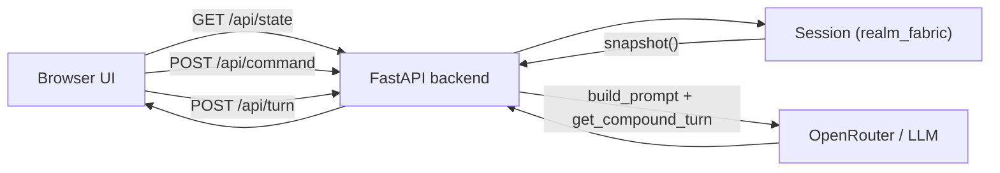

# Version 0.3.1 Changelog

**Purpose:**  
Living record of what ships in **V0.3.1** and why — **not** a pre-implementation checklist. Each section corresponds to an incremental release slice (e.g. `0.3.1a`, `0.3.1b`) so we can implement and review agilely without a full spec up front.

**Baseline:** Builds on **V0.3.0** (`v0.3.0`) — `Session` API, JSON snapshots, `GameProfile`, public `realm_fabric` package, CLI on Session.

**Overall V0.3.1 focus:** Ship **realm-studio**, an example web app that proves the engine works outside the terminal. Primary UX: a **clickable grid** showing agents and objects from `Session.snapshot()`, with **right-click context menus** on empty tiles, agents, and objects to create, edit, or delete entities (via `run_command`). Side panels show passive vision and turn history; **Run turn** drives the LLM for the active agent. The app lives at **`examples/web/realm-studio`** in this repo. It is a **reference consumer**, not part of the core library — engine behavior stays in `realm_fabric` + pytest.

See also: [ROADMAP.md](ROADMAP.md), [v0.3.0-changelog.md](v0.3.0-changelog.md), [LONG_TERM_GOALS.md](../LONG_TERM_GOALS.md).

**Example app location:** [`examples/web/realm-studio`](../examples/web/realm-studio)

**Planned slices (high level):**

| Slice | Theme | Status |
|-------|--------|--------|
| **0.3.1a** | Project scaffold + FastAPI + `Session` holder + snapshot API | ✅ Implemented |
| **0.3.1b** | Grid UI — agents, objects, active-agent highlight | ✅ Implemented |
| **0.3.1c** | Right-click menus + modals → `run_command` / `set_active_agent` | ✅ Implemented |
| **0.3.1d** | LLM compound turn over HTTP | ✅ Implemented |
| **0.3.1e** | Turn log + passive vision panel | ⬜ Planned |
| **0.3.1f** | Docs, run scripts, optional integration test, tag **`v0.3.1`** | ⬜ Planned |

---

## Why a separate example app

V0.3.0 deliberately kept HTTP, WebSockets, and UI out of the engine. **0.3.1** is the first proof that:

- `Session.snapshot()` is enough for a frontend to render state
- `Session.run_command()` and `Session.run_compound_turn()` map cleanly to HTTP handlers
- Custom games can copy `realm-studio` without forking `src/main.py`

The engine package version stays **`0.3.0`** (or patch releases) unless a web-driven bug forces an engine fix. **Tag `v0.3.1`** marks the example app milestone in this monorepo.

---

## Layout — `examples/web/realm-studio`

```
examples/web/realm-studio/
├── README.md              # How to run (dev server, env vars)
├── pyproject.toml         # Depends on realm-fabric (path or >=0.3.0)
├── backend/
│   ├── app.py             # FastAPI app factory
│   ├── session_store.py   # In-memory Session holder (single-player demo)
│   └── routes/            # state, command, turn, agents, …
├── frontend/
│   ├── index.html
│   ├── app.js             # Grid, panels, fetch API
│   └── styles.css
└── tests/
    └── test_api.py        # Optional TestClient smoke tests
```

**Monorepo choice:** Example stays under `examples/web/` so the engine remains the root package; no monorepo split unless maintenance demands it later.

---

## Architecture (draft)



### Design rules

- **Backend** owns the single `Session` instance (demo: one in-memory session per server process).
- **Frontend** never implements perception rules — display `passive_vision` and positions from `snapshot()`.
- **No duplicate sim state** in JavaScript beyond cached snapshot JSON for rendering.
- **Engine API only** in backend imports: prefer `from realm_fabric import Session, load_profile, AgentCompoundTurn`.
- Area-edit strings sent from UI should match CLI syntax where possible (reuse `session.run_command(line)`).
- **Editing does not consume a turn** — only `POST /api/turn` increments simulation progress (mirrors CLI: edits vs `run`).

---

## UI layout (target)

Single-page app: grid is the main surface; editing is **right-click driven** (no separate world-editor screen for v1).

```text
┌─────────────────────────────────────────────────────────────┐
│  realm-studio     Active: [Explorer ▼]        [Run turn ▶]  │
├──────────────────────────────┬──────────────────────────────┤
│                              │  Passive Vision              │
│   Grid (snapshot.grid)       │  (snapshot.passive_vision)   │
│   - one cell per tile        │                              │
│   - agent + object chips     │  Turn log                    │
│   - active agent highlighted │  (results after each turn)   │
│   - right-click → menu       │  session_turn counter        │
└──────────────────────────────┴──────────────────────────────┘
```

| Region | Data source | Interaction |
|--------|-------------|-------------|
| Grid | `snapshot.grid`, `agents[]`, `objects[]` | Right-click tile or entity |
| Active agent | `snapshot.active_agent_id` | Toolbar dropdown + **Play as** in agent menu |
| Passive vision | `snapshot.passive_vision` | Read-only; refreshes after state fetch |
| Turn log | Turn API response + optional step summary | Appends on each successful `/api/turn` |
| Run turn | — | Calls `/api/turn` for **active** agent only |

**Refresh model:** After any command or turn, `GET /api/state` and redraw (simple fetch/poll for v1; WebSockets optional stretch).

**Stacked entities:** Agents and objects may share a tile. Right-click hit-tests the entity under the cursor; if several overlap, show a **pick entity** submenu then the entity-specific menu.

**Visual v1:** Text labels or simple icons on tiles (no sprite assets — **0.3.2+**).

---

## Right-click context menus (0.3.1c)

Menus build CLI-style command lines sent to `POST /api/command` (or `POST /api/active-agent` for play-as). Forms/modals collect fields; backend does not add a parallel edit API.

### Empty tile `(x, y)`

| Action | Effect |
|--------|--------|
| **Create object here…** | Modal → `create-object … at x,y` |
| **Create agent here…** | Modal → `create-agent … at x,y` |

### Agent (right-click agent chip)

| Action | Effect |
|--------|--------|
| **Play as this agent** | `POST /api/active-agent` → `set_active_agent` |
| **Edit…** | Modal: name, position, pdesc, desc, personality → `edit-agent …` |
| **Delete** | Confirm → `delete-agent {id}` |

### Object (right-click object chip)

| Action | Effect |
|--------|--------|
| **Edit…** | Modal: name, position, pdesc, desc → `edit-object …` |
| **Delete** | Confirm → `delete-object {id}` |

### Stacked tile (multiple entities)

| Action | Effect |
|--------|--------|
| **Manage tile…** | List agents/objects on this cell → open entity menu for selection |

### Edit modals — v1 field set (not full CLI parity)

| Entity | Create / edit fields in UI |
|--------|----------------------------|
| **Object** | name, position (pre-filled from click), pdesc, desc; create may offer one simple action stub |
| **Agent** | name, position, pdesc, desc, personality; memory module stays CLI-only for v1 |

Advanced CLI flags (`add-action`, `memory rolling_summary`, …) remain terminal-only until needed.

---

## 0.3.1a — Scaffold + snapshot API

**Status:** ✅ **Implemented** in code.

**Goal:** Runnable backend that exposes live session state as JSON.

### Shipped

| Piece | Detail |
|-------|--------|
| **`examples/web/realm-studio/`** | `pyproject.toml` (path dep on `realm-fabric`), README |
| **FastAPI** | CORS for local dev; `GET /api/health`, `GET /api/state` |
| **`SessionStore`** | `Session.from_profile(load_profile("default_compound"))` singleton |
| **Dev server** | `uv run realm-studio` → http://127.0.0.1:8765 |
| **Minimal frontend** | JSON snapshot viewer (`/` + `/static/*`) — grid UI in **0.3.1b** |

### Run

```powershell
cd examples\web\realm-studio
uv sync
uv run realm-studio
uv run pytest
```

### Tests

- `examples/web/realm-studio/tests/test_api.py` — health, snapshot shape, index page, command + active-agent POST (7 tests)
- Root engine pytest unchanged (274 tests)

---

## 0.3.1b — Grid UI

**Status:** ✅ **Implemented** in code.

**Goal:** Visual grid matching engine bounds; agents and objects visible at their positions; foundation for right-click editing in **0.3.1c**.

### Shipped

| Piece | Detail |
|-------|--------|
| **Grid render** | Dynamic cols/rows from `snapshot.grid` (default 5×5 demo) |
| **Entity chips** | Agents (green) and objects (purple) at `position[]` |
| **Active agent** | Gold border + ★ on chip matching `active_agent_id` |
| **Stacked entities** | Multiple chips per tile when positions collide |
| **Coordinates** | `(x, y)` label on each tile |
| **Refresh** | Load + Refresh button re-fetch `/api/state` |
| **Sidebar** | Turn, active agent, counts; raw JSON in collapsible `<details>` |

### Out (unchanged)

- Right-click menus → **0.3.1c**
- Sprites, drag-and-drop, pathing animation

---

## 0.3.1c — Right-click edit + agent switch

**Status:** ✅ **Implemented** in code.

**Goal:** Right-click on empty tiles, agents, or objects opens a context menu; create/edit/delete via modals that call `session.run_command`. **Play as** sets the active agent without a turn.

### Shipped

| Piece | Detail |
|-------|--------|
| **`POST /api/command`** | `{ "line": "..." }` → `session.run_command` |
| **`POST /api/active-agent`** | `{ "name_or_id": "..." }` → `set_active_agent` |
| **Context menus** | Empty tile, entity chip, stacked-tile manage list |
| **Modals** | Create/edit object and agent; position pre-filled from click |
| **Toast feedback** | Success/error from `CommandResult.message` |
| **Auto refresh** | Grid + sidebar update after successful command |
| **Toolbar** | Active-agent `<select>` synced with snapshot |
| **Frontend modules** | `app.js`, `api.js`, `ui.js` (ES modules) |

### Out (unchanged)

- Full CLI edit surface (memory modules, action builder, …)
- Drag-and-drop reposition
- Auth / multi-user sessions

---

## 0.3.1d — LLM compound turn

**Status:** ✅ **Implemented** in code.

**Goal:** **Run turn** (toolbar) triggers the same flow as CLI `run` for the active agent.

### Shipped

| Piece | Detail |
|-------|--------|
| **`POST /api/turn`** | `gate_agent_turn` → `build_prompt` → `get_compound_turn` → `run_compound_turn` |
| **`backend/turn_runner.py`** | Shared turn logic for HTTP (mirrors CLI `_run_llm_turn_for_agent`) |
| **Run turn ▶ button** | Disabled while request in flight; uses active agent from toolbar |
| **Request body** | Optional `agent_id`, `include_examples` |
| **Response** | `{ ok, message, snapshot?, steps? }` — client redraws grid from snapshot |
| **Errors** | Gate failures, missing API key, LLM parse errors → `{ ok: false, message }` |
| **README** | `OPENROUTER_API_KEY` setup documented |

### Out (unchanged)

- Streaming LLM tokens to browser
- Manual `step-compound` in UI (CLI remains reference)
- Running a turn from right-click menu (always toolbar / active agent for clarity)

---

## 0.3.1e — Turn log + passive vision

**Status:** ⬜ **Planned**

**Goal:** Panels that explain *what the agent sees* and *what happened*.

### Scope

| In | Detail |
|----|--------|
| Passive vision panel | Render `snapshot.passive_vision` for active agent |
| Turn log | Append composite results / step summaries after each turn |
| Session turn counter | Display `snapshot.session_turn` |
| Optional prompt viewer | Debug toggle: last prompt text (dev only) |

---

## 0.3.1f — Release polish

**Status:** ⬜ **Planned**

**Goal:** Someone can clone the repo, run realm-studio, and play the demo room in a browser.

### Scope

| In | Detail |
|----|--------|
| `examples/web/realm-studio/README.md` | Prerequisites, env, run backend + open frontend |
| Root README link | Point “Engine vs apps” to realm-studio |
| ROADMAP | Mark V0.3.1 complete |
| Integration tests | Minimal API smoke in example `tests/` |
| Tag | **`git tag v0.3.1`** (example milestone; engine may remain `0.3.0.x`) |

---

## HTTP API (draft)

| Method | Path | Maps to |
|--------|------|---------|
| `GET` | `/api/health` | Liveness |
| `GET` | `/api/state` | `session.snapshot()` |
| `POST` | `/api/command` | `session.run_command(line)` |
| `POST` | `/api/active-agent` | `session.set_active_agent(...)` |
| `POST` | `/api/turn` | LLM + `session.run_compound_turn(...)` |
| `GET` | `/api/prompt` | `session.build_prompt()` (optional, dev) |

All responses JSON. Errors: `{ "ok": false, "message": "..." }` aligned with engine result types.

---

## Explicitly out of V0.3.1

| Item | Target |
|------|--------|
| Multiplayer / rooms / auth | **0.4+** |
| Multi-area sessions | **V0.4** |
| Swappable LLM schemas | **V0.4** |
| Save/load snapshot round-trip | Later |
| Production deploy (Docker, HTTPS) | Out of scope for example |
| Sprites / `appearance` | **V0.3.2+** |
| Drag-and-drop move on grid | Later (use edit position or future pathing) |
| In-browser prompt / GameProfile editor | Later |
| WebSocket live sync | Optional stretch; fetch-after-mutation OK for v1 |

---

## Release — V0.3.1 (`v0.3.1`)

**Status:** ⬜ **Not started**

### Ship checklist (when slices complete)

| Step | Detail |
|------|--------|
| Example app | `examples/web/realm-studio` runs locally |
| Engine dep | `realm-fabric>=0.3.0` (path dep in dev) |
| Tests | Engine `uv run pytest` green; example API smoke optional |
| Docs | This changelog, realm-studio README, ROADMAP |
| Tag | **`git tag v0.3.1`** |
| Proof | Grid with right-click create/edit/delete + at least one LLM **Run turn** end-to-end |

---

**Notes**

- Prefer adding **sections to this changelog** as slices ship (mirror [v0.3.0-changelog.md](v0.3.0-changelog.md)).
- Do not move FastAPI or frontend code into `src/` — keep the engine import boundary clean.
- If the example needs a small engine hook, add it to `realm_fabric` in a **`0.3.0.x`** patch with tests, not in the example only.
